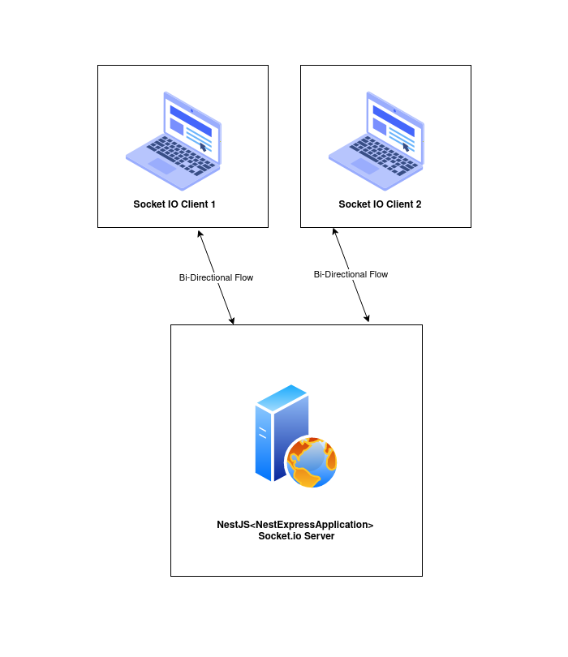

# Game Of Three

A game of three challenge, its a game played by two players


### How to run

- Clone the repo
```sh
git clone https://github.com/prashanthvish/game-of-three.git
```

- Change the current directory to cloned repo
```sh
cd game-of-three
```

- Open the terminal and type the following commands 
```sh
npm install
npm run start
```
- Open a new browser tab with the following url for player 1: `http://localhost:3000`
- Open an another new tab or new window for the player 2: `http://localhost:3000`


### How to run tests

```sh
npm run test
```


### Architecture Diagram




### Assumptions
- The game is played only by two players at any moment.
- If the whole number is n, where n >= 0 and n<= 100 is assumed.
- Make sure all browser clients are closed before starting a new game.
